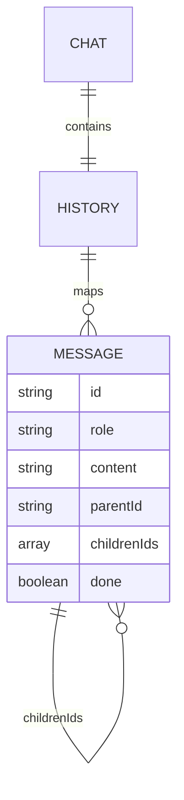
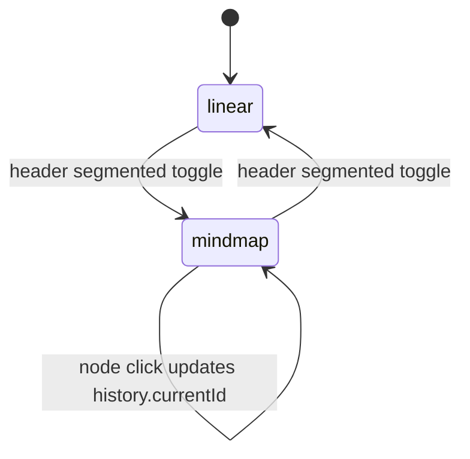
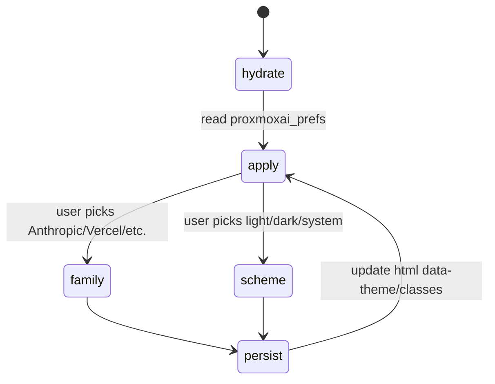
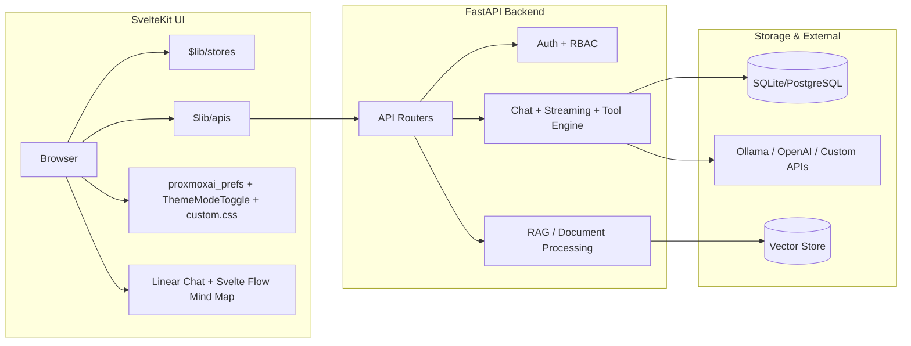

# Open WebUI — AI Context Pack

> Generated from `/root/AI_CONTEXT_TEMPLATE.md` and expanded for the VNSO customized Open WebUI fork.
>
> Hard rule. Default admin credentials are `admin@vnso.vn / Admin@@3224@@`. Never change them in seeds, fixtures, env files, migrations, or docs examples.
>
> Theme system. This frontend follows [THEME_CONTRACT.md](THEME_CONTRACT.md) using `localStorage('proxmoxai_prefs')`, [src/app.html](src/app.html), [src/lib/components/common/ThemeModeToggle.svelte](src/lib/components/common/ThemeModeToggle.svelte), [static/static/custom.css](static/static/custom.css), and [static/static/proxmoxai-themes.css](static/static/proxmoxai-themes.css). The nested `static/static/*` path is intentional: SvelteKit serves it at `/static/*`.

## 0. TL;DR

- Does. Open WebUI is a SvelteKit + FastAPI AI workspace with chat, branching, RAG, tools/functions, files, automations, admin surfaces, and VNSO theme integration.
- Why. It gives VNSO a self-hosted multi-model workspace with enterprise controls and a chat-native structured conversation view.
- Status. `prod-customized | vnso branch`
- Revenue / purpose. `internal | enterprise AI workspace | VNSO platform surface`
- Long-term UI choice. Keep the Linear Chat as default; use Svelte Flow + Dagre for the Mind Map canvas because requirements include pan, zoom, edges, custom nodes, and active branch sync. Do not fork a separate hand-rolled graph engine unless Svelte Flow becomes a proven blocker.

## 1. AI Quick Index & Key Files

| Domain                     | File path                                                                                                                 | Responsibility / notes                                                                                                |
| -------------------------- | ------------------------------------------------------------------------------------------------------------------------- | --------------------------------------------------------------------------------------------------------------------- |
| Frontend: chat shell       | [src/lib/components/chat/Chat.svelte](src/lib/components/chat/Chat.svelte)                                                | Main chat state owner; switches Linear vs Mind Map; persists active branch through `history.currentId`.               |
| Frontend: chat header      | [src/lib/components/chat/Navbar.svelte](src/lib/components/chat/Navbar.svelte)                                            | Header actions; segmented Linear/Mind Map toggle; theme picker entry.                                                 |
| Frontend: linear view      | [src/lib/components/chat/Messages.svelte](src/lib/components/chat/Messages.svelte)                                        | Standard message branch renderer.                                                                                     |
| Frontend: mind map wrapper | [src/lib/components/chat/MindMapMessages.svelte](src/lib/components/chat/MindMapMessages.svelte)                          | Wraps Mind Map canvas in `SvelteFlowProvider`.                                                                        |
| Frontend: mind map canvas  | [src/lib/components/chat/MindMapMessages/Canvas.svelte](src/lib/components/chat/MindMapMessages/Canvas.svelte)            | Converts chat tree to Svelte Flow `nodes`/`edges`, uses Dagre layout, pan/zoom/focus.                                 |
| Frontend: mind map node    | [src/lib/components/chat/MindMapMessages/ChatNode.svelte](src/lib/components/chat/MindMapMessages/ChatNode.svelte)        | Custom node preview, avatar, active branch badge.                                                                     |
| Frontend: state & utils    | [src/lib/stores/index.ts](src/lib/stores/index.ts), [src/lib/utils/index.ts](src/lib/utils/index.ts)                      | Shared Svelte stores, history conversion, message list helpers.                                                       |
| Theme: pre-paint HTML      | [src/app.html](src/app.html)                                                                                              | Runs VNSO theme bootstrap before paint; exposes `window.__setTheme`, `window.__setColorScheme`, `window.__setLocale`. |
| Theme: picker UI           | [src/lib/components/common/ThemeModeToggle.svelte](src/lib/components/common/ThemeModeToggle.svelte)                      | Theme family picker: Anthropic, Vercel, GitHub, Linear, Stripe, Notion, etc.                                          |
| Theme: CSS bridge          | [static/static/custom.css](static/static/custom.css)                                                                      | Open WebUI Tailwind/class bridge to VNSO CSS variables; served as `/static/custom.css`.                               |
| Theme: copied palette      | [static/static/proxmoxai-themes.css](static/static/proxmoxai-themes.css)                                                  | ProxmoxAI premium theme CSS; served as `/static/proxmoxai-themes.css`.                                                |
| Backend: entrypoint        | [backend/open_webui/main.py](backend/open_webui/main.py)                                                                  | FastAPI app initialization, routers, middleware, lifecycle.                                                           |
| Backend: config/env        | [backend/open_webui/config.py](backend/open_webui/config.py), [backend/open_webui/env.py](backend/open_webui/env.py)      | Environment loading, feature flags, deployment constants.                                                             |
| Backend: routers           | [backend/open_webui/routers/](backend/open_webui/routers)                                                                 | API endpoints for chats, users, files, models, retrieval, tools, automations.                                         |
| Backend: models            | [backend/open_webui/models/](backend/open_webui/models)                                                                   | SQLAlchemy data access models and JSON payload contracts.                                                             |
| Backend: RAG               | [backend/open_webui/retrieval/](backend/open_webui/retrieval)                                                             | Document loading, chunking, embeddings, vector store integration.                                                     |
| Backend: tools/functions   | [backend/open_webui/tools/](backend/open_webui/tools), [backend/open_webui/functions.py](backend/open_webui/functions.py) | Tool/function execution surfaces.                                                                                     |
| DB migrations              | [backend/open_webui/migrations/](backend/open_webui/migrations)                                                           | Alembic migrations; required for schema changes.                                                                      |
| Deployment                 | [docker-compose.yaml](docker-compose.yaml), [Dockerfile](Dockerfile)                                                      | Compose and container build/deploy entrypoints.                                                                       |
| VNSO docs                  | [docs/VNSO_DUAL_MODE_AND_THEME.md](docs/VNSO_DUAL_MODE_AND_THEME.md)                                                      | Product/implementation contract for chat dual-mode and theme picker.                                                  |

## 2. Repository Topology

- [src/](src) — SvelteKit frontend, routes, components, stores, APIs, i18n.
- [backend/](backend) — FastAPI backend, routers, models, retrieval, auth, tools, migrations.
- [static/](static) — browser-served assets. `static/static/custom.css` maps to `/static/custom.css`.
- [docs/](docs) — project docs and VNSO implementation notes.
- [cypress/](cypress), [test/](test) — frontend/e2e/test surfaces.
- [docker-compose.yaml](docker-compose.yaml), [Dockerfile](Dockerfile) — deployment entrypoints.

## 3. System Boundaries

Owns:

- Chat UX, branch state, message rendering, file/tool controls, admin configuration, user-facing model interactions.
- Backend API facade for chats, users, model providers, retrieval, tools, automations, auth, and RBAC.
- VNSO theme bootstrap, picker UI, local CSS bridge, and cross-app `proxmoxai_prefs` shape.

Does not own:

- External model quality, provider uptime, browser localStorage isolation across subdomains, or host GPU/native package availability.

Internationalization:

- Open WebUI uses i18next dictionaries in [src/lib/i18n/](src/lib/i18n).
- Do not hardcode user-visible English/Vietnamese strings directly in Svelte markup. Use `$i18n.t('Text')` and add Vietnamese keys when text is VNSO-specific.

Styling:

- Tailwind first for layout, spacing, typography, and states.
- Theme colors come from VNSO/ProxmoxAI variables in [static/static/custom.css](static/static/custom.css) and [static/static/proxmoxai-themes.css](static/static/proxmoxai-themes.css).
- Avoid new hardcoded hex palettes. Custom components must support light and dark modes.

## 4. Golden Path

```bash
cd /root/open-webui
npm run build
```

For local frontend iteration without changing Pyodide lock metadata:

```bash
cd /root/open-webui
npx vite dev --host 0.0.0.0 --port 5173
```

Notes:

- The current host has used Node 20.20.1; some transitive packages warn about Node >=22. If only lock metadata is needed, use `npm install <pkg> --package-lock-only --engine-strict=false`.
- `npm run build` invokes `pyodide:fetch` and may churn [static/pyodide/pyodide-lock.json](static/pyodide/pyodide-lock.json). Revert that generated change unless intentionally updating Pyodide.
- `npm run check` can report many upstream Svelte/type issues unrelated to a narrow change; file-level diagnostics and production build are the practical gate in this fork.

## 5. Environment Variables Contract

- Use upstream Open WebUI env contracts for production. Do not invent env vars when an existing config key exists.
- Treat secrets as deployment-only values; never commit live tokens, API keys, or generated credentials.
- Key variables: `OLLAMA_BASE_URL`, `OPENAI_API_KEY`, `WEBUI_SECRET_KEY`, `DATABASE_URL`, provider-specific API keys, storage backend settings, and document/file limits such as max upload/document size.
- Preserve the default admin credential rule above where seed examples exist.

## 6. Data Model & Frontend State

Frontend chat history is a tree:



Backend storage:

- Backend uses SQLAlchemy with SQLite by default or PostgreSQL in production through `DATABASE_URL`.
- Chat metadata and history are stored in chat model payloads, with message/history data serialized as JSON blobs where appropriate.
- Schema changes must go through Alembic migrations under [backend/open_webui/migrations/](backend/open_webui/migrations).

Critical frontend state:

- `$chatId` — active chat session id.
- `$chats` — sidebar chat list.
- `$models` — available LLMs fetched from backend.
- `$user` — authenticated user, role, permissions.
- `$settings` — UI and user preferences.
- `history.currentId` — active branch node. Linear Chat renders ancestors from this id; Mind Map highlights the same branch and updates this id on node click.

## 7. State Machines

Chat view mode:



Theme preference flow:



## 8. API & Integration Contracts

- Use [src/lib/apis](src/lib/apis) wrappers for frontend API calls. Do not call `fetch` ad hoc from chat components unless no wrapper exists.
- Chat streaming uses SSE/stream chunks. When modifying message rendering or mind map previews, do not perform heavy synchronous markdown parsing on each streamed chunk.
- Use `toast.error()` or existing user-facing error paths for API errors. Do not leave production failures as only `console.log`.
- Do not bypass backend RBAC by hiding only frontend UI; backend routers must enforce permissions.

## 8.5. AI Features: RAG, Tools, Automations & Files

- RAG document parsing/chunking lives under [backend/open_webui/retrieval/](backend/open_webui/retrieval). Vector data is stored through configured vector DB integrations such as Chroma/pgvector depending on deployment.
- File upload UI starts in [src/lib/components/chat/MessageInput/](src/lib/components/chat/MessageInput); uploaded file ids are attached to chat payloads.
- Excel previews are guarded by [src/lib/utils/excelPreview.ts](src/lib/utils/excelPreview.ts) to cap preview size and render rows/columns because `xlsx` currently has no upstream advisory fix.
- Tools/functions execute in backend-controlled surfaces. Check [backend/open_webui/tools/](backend/open_webui/tools), [backend/open_webui/functions.py](backend/open_webui/functions.py), and chat routers before changing execution flow.
- System prompts and model settings are managed through UI/database state. Do not hardcode prompts in frontend unless explicitly a VNSO product requirement.

## 9. Architecture



## 10. Failure Modes & Trade-offs

| Failure                      | Impact                             | Mitigation                                                                                                                                                                                                                                        |
| ---------------------------- | ---------------------------------- | ------------------------------------------------------------------------------------------------------------------------------------------------------------------------------------------------------------------------------------------------- |
| Corrupt chat tree            | Linear or Mind Map misses branches | Guard missing parents and visited ids when flattening history.                                                                                                                                                                                    |
| Huge chat tree               | Canvas layout/render cost rises    | rAF-throttle layout, render Mind Map only when selected, consider lazy branch expansion later.                                                                                                                                                    |
| Missing `SvelteFlowProvider` | Mind Map fails at runtime          | Keep hooks in [src/lib/components/chat/MindMapMessages/Canvas.svelte](src/lib/components/chat/MindMapMessages/Canvas.svelte), wrapped by [src/lib/components/chat/MindMapMessages.svelte](src/lib/components/chat/MindMapMessages.svelte).        |
| Theme mismatch               | Flash or unreadable surfaces       | Keep pre-paint bootstrap in [src/app.html](src/app.html), picker in [src/lib/components/common/ThemeModeToggle.svelte](src/lib/components/common/ThemeModeToggle.svelte), and CSS bridge in [static/static/custom.css](static/static/custom.css). |
| Native npm scripts fail      | Dependency install blocks          | Use package-lock-only metadata updates on Node 20, or run npm under Node 22.                                                                                                                                                                      |
| Untrusted file previews      | Browser freeze or unsafe preview   | Use preview caps and sanitization; keep DOMPurify paths intact.                                                                                                                                                                                   |

## 11. SLO / Performance Targets

- Chat branch switch should feel immediate for normal histories.
- Mind Map pan/zoom should stay smooth for typical chat trees.
- Streaming message updates should not trigger expensive full graph re-layout unless visible and necessary.
- Frontend build should complete without modifying tracked generated assets except intentional updates.

## 12. Deployment Topology & Evolution

Stage 1:

- Existing Open WebUI Docker/Compose deployment.

Stage 2:

- VNSO theme contract, theme picker, and dual-mode chat visualization shipped on branch `vnso`.

Stage 3:

- Cross-subdomain preference hydration through the VNSO auth preferences API in [THEME_CONTRACT.md](THEME_CONTRACT.md).
- Optional lazy branch expansion or mini-map sidebar if very large chat trees become common.

## 13. Security & Threat Model

- Authentication uses session/JWT mechanisms handled by existing auth APIs and middleware.
- Authorization/RBAC is enforced by backend routers; frontend admin-only UI should still check `$user.role === 'admin'` or permissions before rendering.
- Treat chat content, uploaded files, prompts, model outputs, tool responses, markdown, and HTML as untrusted.
- Keep DOMPurify/sanitization paths intact.
- Mind Map nodes render plain text previews only; do not introduce arbitrary HTML rendering there.
- Never expose default credentials beyond docs/seeds where explicitly required by the VNSO hard rule.

## 14. Observability

- Browser console warnings are acceptable for malformed local history but must not expose secrets.
- Backend observability follows upstream Open WebUI logging, metrics, telemetry, and deployment configuration.
- For UI regressions, capture the route, active chat id, `history.currentId`, theme prefs, and console error.

## 15. Testing Strategy

- Frontend build: `npm run build`.
- Frontend type check: `npm run check` when working through broader repo type debt.
- Backend tests: run pytest if configured for the touched backend surface.
- JSON/i18n validation: `python3 -m json.tool src/lib/i18n/locales/vi-VN/translation.json` after locale edits.
- Targeted smoke: open a chat, switch Linear -> Mind Map, pan/zoom, click a node, switch back, confirm Linear follows the selected branch.
- Theme smoke: open theme picker, choose Anthropic/Vercel/GitHub/Linear/Stripe, switch light/dark/system, confirm `<html data-theme>` changes before/without reload.

## 16. Operational Runbook

```bash
cd /root/open-webui
git status --short
npm run build
```

Dependency metadata on Node 20:

```bash
npm install <pkg> --package-lock-only --engine-strict=false
```

Backend migrations:

```bash
cd /root/open-webui/backend
alembic revision --autogenerate -m "Describe schema change"
alembic upgrade head
```

Hard rule: never modify production database schema directly with ad hoc SQL. Use Alembic migrations so VNSO deployments stay consistent.

## 17. Investor / Business Pitch

VNSO Open WebUI turns self-hosted AI into a practical team workspace: model choice, enterprise control, file/RAG workflows, tools, automations, and branch visualization in one deployable surface.

## 18. Pending / Roadmap

- Persist last-used chat view mode per user if product wants preference restoration.
- Add lazy branch expansion for extremely large chat trees.
- Add e2e coverage for Mind Map branch selection and theme picker once auth fixtures are available.
- Hydrate `proxmoxai_prefs` from the VNSO cross-subdomain preferences API after login.

## Change Log

- 2026-05-05 — Expanded context pack with backend/RAG/tools/state/i18n/security/migration guidance and synchronized it with dual-mode chat + VNSO theme picker implementation.
