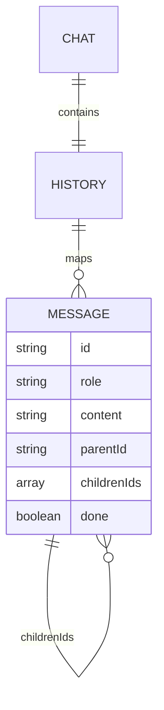
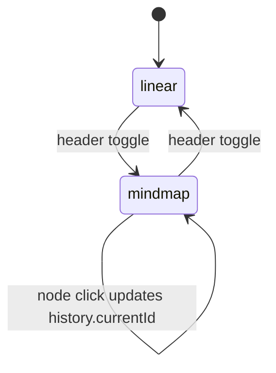
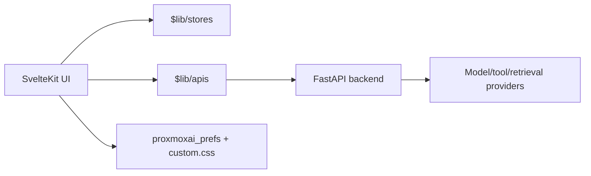

# Open WebUI — AI Context Pack

> Generated from `/root/AI_CONTEXT_TEMPLATE.md` for the VNSO customized Open WebUI workspace.
>
> Hard rule. Default admin credentials are `admin@vnso.vn / Admin@@3224@@`. Never change them in seeds, fixtures, env files, migrations, or docs examples.
>
> Theme system. This frontend follows [THEME_CONTRACT.md](THEME_CONTRACT.md) using `localStorage('proxmoxai_prefs')` and the ProxmoxAI theme CSS copied into [static/static/proxmoxai-themes.css](static/static/proxmoxai-themes.css).

## 0. TL;DR

- Does. Open WebUI is a SvelteKit + FastAPI chat platform with model routing, tools, file workflows, voice, automations, and admin surfaces.
- Why. It provides a self-hosted AI workspace that can run across local and hosted model providers while keeping enterprise controls in one UI.
- Status. `prod-customized`
- Revenue / purpose. `internal | enterprise AI workspace | VNSO platform surface`

## 1. AI Quick Index

| If you want to ...       | Open first                                                                                                         |
| ------------------------ | ------------------------------------------------------------------------------------------------------------------ |
| Chat UI shell            | [src/lib/components/chat/Chat.svelte](src/lib/components/chat/Chat.svelte)                                         |
| Chat header controls     | [src/lib/components/chat/Navbar.svelte](src/lib/components/chat/Navbar.svelte)                                     |
| Linear messages          | [src/lib/components/chat/Messages.svelte](src/lib/components/chat/Messages.svelte)                                 |
| Mind map messages        | [src/lib/components/chat/MindMapMessages.svelte](src/lib/components/chat/MindMapMessages.svelte)                   |
| Mind map node card       | [src/lib/components/chat/MindMapMessages/ChatNode.svelte](src/lib/components/chat/MindMapMessages/ChatNode.svelte) |
| Shared stores            | [src/lib/stores/index.ts](src/lib/stores/index.ts)                                                                 |
| Chat history helpers     | [src/lib/utils/index.ts](src/lib/utils/index.ts)                                                                   |
| Frontend theme bootstrap | [src/app.html](src/app.html)                                                                                       |
| VNSO theme bridge        | [static/static/custom.css](static/static/custom.css)                                                               |
| Backend entrypoint       | [backend/open_webui/main.py](backend/open_webui/main.py)                                                           |
| Compose deployment       | [docker-compose.yaml](docker-compose.yaml)                                                                         |

## 2. Repository Topology

- [src/](src) — SvelteKit frontend, routes, components, stores, APIs, i18n.
- [backend/](backend) — FastAPI backend and Open WebUI service modules.
- [static/](static) — browser-served assets; [static/static/custom.css](static/static/custom.css) is loaded as `/static/custom.css`.
- [docs/](docs) — upstream docs.
- [cypress/](cypress), [test/](test) — frontend/e2e/test surfaces.
- [docker-compose.yaml](docker-compose.yaml), [Dockerfile](Dockerfile) — deployment entrypoints.

## 3. System Boundaries

Owns:

- Chat UX, branch state, message rendering, file/tool controls, admin configuration, user-facing model interactions.
- Backend API facade for chats, users, model providers, retrieval, tools, automations, and auth.
- VNSO theme bootstrap and local custom CSS contract.

Does not own:

- External model quality, provider availability, browser localStorage isolation across subdomains, or GPU/native package availability on the host.

External dependencies:

- npm/SvelteKit/Tailwind frontend stack, FastAPI/Python backend stack, provider APIs, Ollama/OpenAI-compatible endpoints, object stores/databases configured by deployment.

## 4. Golden Path

```bash
cd /root/open-webui
npm run check
npm run build
```

For local frontend iteration:

```bash
cd /root/open-webui
npm run dev
```

Notes:

- The current environment is Node 20.20.1. Some transitive packages warn about Node >=22; use `--engine-strict=false` when updating npm metadata under this host.
- Native install scripts such as `onnxruntime-node` may fail in lightweight environments. Prefer `npm install --package-lock-only --engine-strict=false` when only lockfile metadata is needed.

## 5. Environment Variables Contract

Use upstream Open WebUI env contracts for production. Treat secrets as deployment-only values; never commit live tokens or generated credentials. Preserve the default admin credential rule above where seed examples exist.

## 6. Data Model

Chat history is a tree:



Critical invariant:

- `history.currentId` points to the active message branch leaf or selected node.
- Linear chat renders ancestors from `history.currentId` back to root.
- Mind map and linear mode share the same `history` object; changing `history.currentId` changes both views.

## 7. State Machines

Chat view mode:



## 8. API & Integration Contracts

Use [src/lib/apis](src/lib/apis) for frontend API wrappers. Do not call `fetch` ad hoc from chat components unless an established wrapper does not exist.

## 9. Architecture



## 10. Failure Modes & Trade-offs

| Failure                 | Impact                               | Mitigation                                                                                                                           |
| ----------------------- | ------------------------------------ | ------------------------------------------------------------------------------------------------------------------------------------ |
| Corrupt chat tree       | Linear or mind map can miss branches | Guard cycles and missing parent ids when flattening history                                                                          |
| Huge branch tree        | Canvas render/layout cost rises      | Use frame-throttled layout and avoid rendering mind map while hidden                                                                 |
| Native npm scripts fail | Dependency install blocks            | Use package-lock-only for metadata-only dependency changes                                                                           |
| Theme mismatch          | Flash or unreadable surfaces         | Keep pre-paint bootstrap in [src/app.html](src/app.html) and variable bridge in [static/static/custom.css](static/static/custom.css) |

## 11. SLO / Performance Targets

- Chat branch switch should be immediate for normal histories.
- Mind map layout should stay interactive for typical chat trees; for very large trees, future work should add virtualization or lazy branch expansion.
- Avoid re-layout work outside mind map mode.

## 12. Deployment Topology & Evolution

Stage 1:

- Existing Open WebUI deployment through Docker/Compose.

Stage 2:

- VNSO theme contract and customized chat visualization shipped on branch `vnso`.

Stage 3:

- Add cross-subdomain preference hydration through the VNSO auth preferences API described in [THEME_CONTRACT.md](THEME_CONTRACT.md).

## 13. Security & Threat Model

- Treat chat content, files, prompts, model outputs, and tool responses as untrusted.
- Keep markdown/rendered HTML sanitation paths intact.
- Do not introduce arbitrary HTML in custom nodes; mind map previews render plain text only.
- Preserve auth and permission checks in existing backend/frontend wrappers.

## 14. Observability

- Browser console warnings are acceptable for malformed local history but should not expose secrets.
- Backend observability follows upstream Open WebUI configuration and deployment metrics.

## 15. Testing Strategy

- Frontend type check: `npm run check`.
- Frontend build: `npm run build`.
- Targeted browser smoke: open a chat, toggle Linear/Mind Map, click a node, toggle back, confirm the linear branch follows the selected node.

## 16. Operational Runbook

```bash
cd /root/open-webui
git status --short
npm run check
npm run build
```

When dependency metadata must be updated on Node 20:

```bash
npm install <pkg> --package-lock-only --engine-strict=false
```

## 17. Investor / Business Pitch

VNSO Open WebUI turns self-hosted AI into a practical team workspace: model choice, enterprise control, files/tools, and branch visualization in one deployable surface.

## 18. Key Files for AI

1. [src/lib/components/chat/Chat.svelte](src/lib/components/chat/Chat.svelte) — main chat shell and state owner.
2. [src/lib/components/chat/Navbar.svelte](src/lib/components/chat/Navbar.svelte) — header actions and view toggle.
3. [src/lib/components/chat/Messages.svelte](src/lib/components/chat/Messages.svelte) — linear branch renderer.
4. [src/lib/components/chat/MindMapMessages.svelte](src/lib/components/chat/MindMapMessages.svelte) — mind map renderer.
5. [src/lib/components/chat/MindMapMessages/ChatNode.svelte](src/lib/components/chat/MindMapMessages/ChatNode.svelte) — custom Svelte Flow node.
6. [src/lib/utils/index.ts](src/lib/utils/index.ts) — history conversion and message list utilities.
7. [src/app.html](src/app.html) — pre-paint VNSO theme bootstrap.
8. [static/static/custom.css](static/static/custom.css) — Open WebUI theme variable bridge.

## 19. Pending / Roadmap

- Add persisted user preference for chat view mode if product wants last-used mode restored.
- Add lazy branch expansion for extremely large chat trees.
- Add e2e coverage for mind map branch selection once auth fixtures are available.

## Change Log

- 2026-05-05 — Added VNSO context pack, theme contract, ProxmoxAI theme CSS, and dual-mode chat architecture notes.
